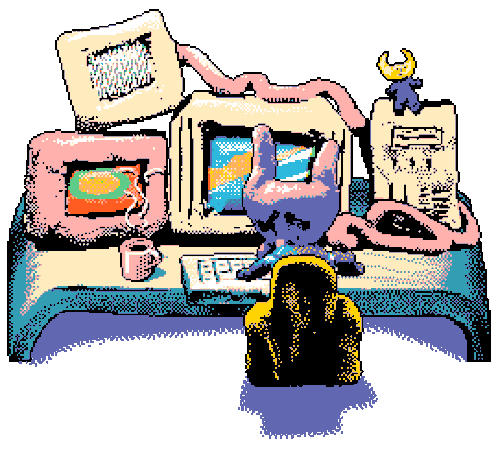

  
  <td valign="center">
  <pre><b>
  gabriel-melo19@bazzite
  ---------------------- 

   
  
  Web
  
  
  Backend
  
  
  Games 
  

  Tools
  
  </b></pre>
  </td>

<!--
 

  
<b>Gabriel Melo</b>
  
Desenvolvedor Web e Games

 

  
<b>Web</b>
 

 

  
<b>Back-End & Database</b>
 

 

  
<b>Games</b>
 

 

  
<b>Tools</b>
 

 

-->

## Redes

